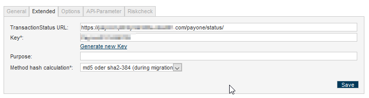
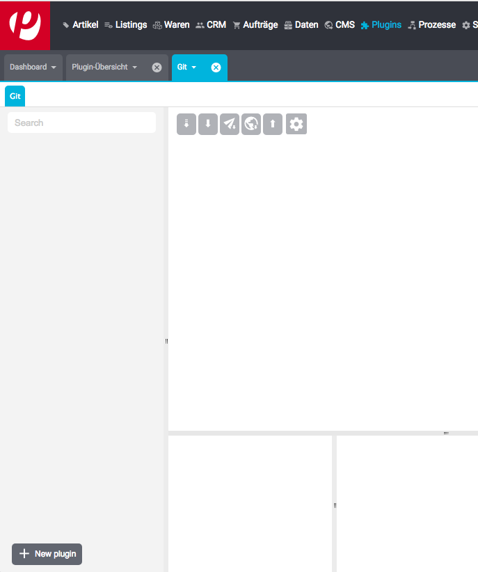
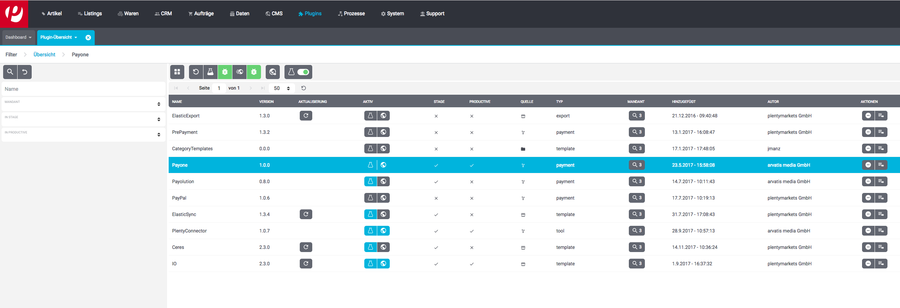
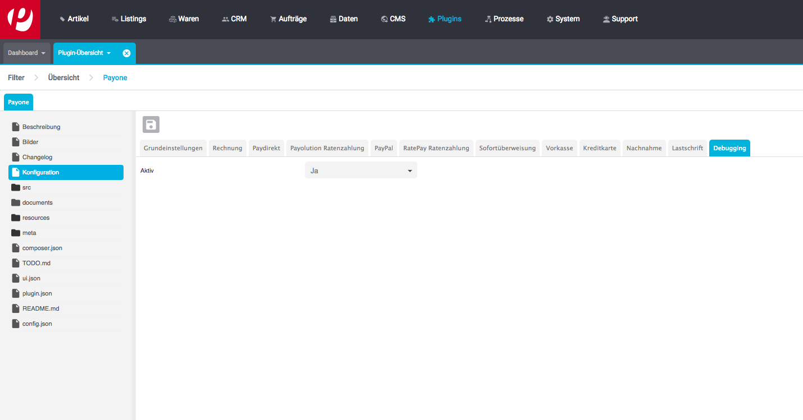
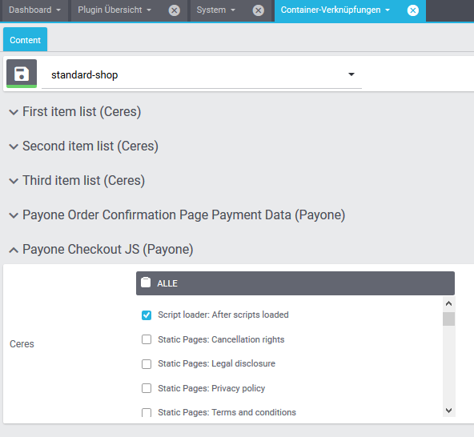
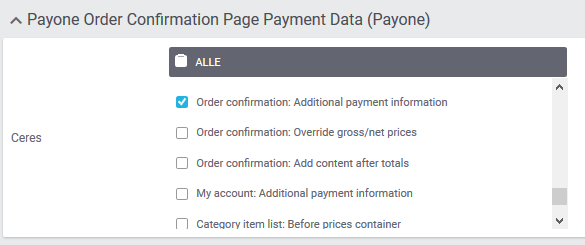

#  BS Payone plugin for plentymarkets 7

## Plugin description and requirements

See the [plugin description](./meta/documents/user_guide_de.md) for the plentymarkets marketplace.

## Requirements

The plugin has been developed for the Ceres template. The plugins IO and Ceres 
are required and have to be active.

Also, please configure your payment portal in your BS PAYONE PMI for sha2-384 hashes. The TransactionStatus URL follows this template: 

https://www.example.com/payone/status/



## Installation

A github account is required to be able to install the plugin. In your plentymarkets backend navigate to 
"Plugins -> GIT". Now click "New plugin" in the bottom left corner:



A popup will prompt you to enter your github credentials:


 
It is recommended to use an account which has only been created 
for the plugin installation. After adding the plugin it will show up in the pugin overview. The provisioning process is 
the same as for plugins installed from the plentymarkets marketplace.

## Basic configuration

Set up the payone account and configure the payments method in the plentymarkets backend:

* Navigate to "Plugins"

* Double click on the payone plugin:



* Enter settings in each configuration tab:



you can find the necessary portal data in the "API-Parameter" tab of your PMI portal. 

* Save changes

### Integrate payment methods into the checkout
 
For payment methods like credit card, that use custom JS in the checkout to work, the template container "Payone Checkout JS" has to be added to 
"Script loader: After scripts loaded".



### Setting up event actions 

To fully integrate the plugin event actions have to be set up for capture, refund and returns. The event actions 
"Payone | Capture order" and "Payone | Refund order" have to be set up according to your workflow.

### Show clearing data on order success page

To add a text to the order success page on how to fullfill the paymen set up the payone payment containers.
The "Payone Order Confirmation Page Payment Data" container needs to be added to the 
 "Order confirmation: Additional payment information" block.
 
 

## Tests

To run the unit tests execute 

```phpunit --exclude-group online```

To run tests agains the Payone API, set up your merchant credentials in the phpunit.ini file (see phpunit.ini.dist as 
reference for the field names).

Run ```phpunit```

## Changelog

See the [changelog](./CHANGELOG.md).

## Need help?

Please contact our technical support team at +49 259 68-500 or tech.support[at]bspayone.com