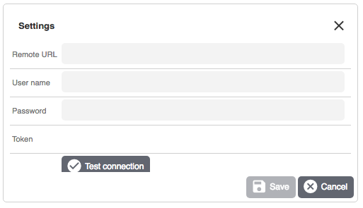

#  BS Payone plugin for plentymkarkets 7

## Plugin description and requirements

See the [plugin description](./meta/documents/user_guide_de.md) for the plentymarkets marketplace.

## Installation

A github account es required to be able to install the plugin. In your plentymarkets backend navigate to 
"Plugins -> GIT". Now click "New plugin" int the bottom left corner:


A popup will prompt you to enter your github credentials:


 
It is recommended to use an account which has only been created 
for the plugin installation. After adding the plugin it will show up in the pugin overview. The provisioning process is 
the same as for plugins installed from the plentymarkets marketplace.

To configure the plugin after installation see the chapter in the [plugin description](./meta/documents/user_guide_de.md).

## Tests

To run the unit tests execute 

```phpunit --exclude-group online```

To run tests agains the Payone API, set up your merchant credentials in the phpunit.ini file (see phpunit.ini.dist as 
reference for the field names).

Run ```phpunit```

## API Documentation

See the documents in the [documents](./documents/) folder.

## Changelog

See the [changelog](./meta/documents/changelog_de.md).