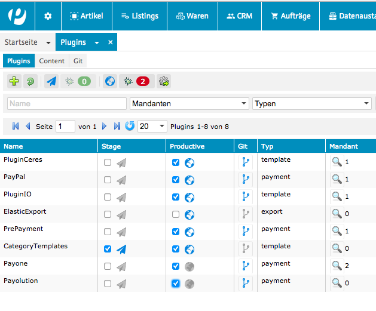
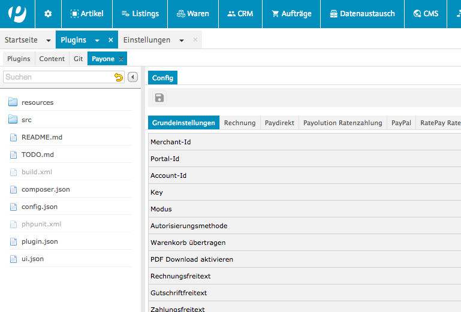

# Payone plugin für plentymarkets 7.x

   <strong><i>Bitte beachten:</strong></i> Das Plugin wurde für das Ceres Template entwickelt. Die Plugins und Ceres 
   müssen daher zwingend instaliert und aktiv sein.

## Installation

Detaillierte Informationen zur Plugin-Provisionierung finden sich unter [plentymarkets developers](https://developers.plentymarkets.com/dev-doc/basics#plugin-provisioning).

Bei der Installation des Plugins beachtee Sie bitte, dass unter "Client" die gewünschten Mandanten ausgewählt sind. Unter "Actions" sollte die Prioorität der Plugins gesetzt werden. Dies ist unter anderem wichtig, damit die durch das Plugin definierten Frontend URLs erreichbar sind. Es empfiehlt sich, die Priotität des IO-Plugins auf einen hohen Wert, z.B.  999, zu setzen.

## Konfiguration

Im Folgenden wird beschrieben, wo Sie die Konfiguration der Zahlarten finden und diese anpassen können.

* Melden Sie sich im Plentymarkets-Backend an

* Navigieren Sie im Menü zu "Plugins"

* Wählen Sie das Payone-Plugin durch Doppelklick aus:

* Wählen Sie den gewünschten Reiter der Konfiguration:

* Änderungen vornehmen und speichern

## Ereignisaktionen einrichten

Ereignisaktionen müssen eingerichtet werden. Nur über sie kann das erfassen und die Gutschrift von Bestellungen erfolgen. Ereignisaktionen stellen eine flexible Möglichkeit dar, notwendige Request an die Payone Schnittstelle in Ihren Bestellablauf zu integrieren.

###Ereignisaktion für die Buchung des Warenausgangs erstellen:

1. Öffnen Sie das Menü "Einstellungen ›› Aufträge ›› Ereignisaktionen".
2. Klicken Sie links unten auf das grüne Plus, um eine neue Ereignisaktion zu erstellen.
3. Tragen Sie im Bearbeitungsfenster einen Namen ein, z.B. „Payone - Warenausgang“.
4. Wählen Sie unter Ereignis die Option "Auftragsänderung ›› Warenausgang gebucht".
5. Klicken Sie auf "Speichern". 
5. Fügen Sie mit dem grünen Plus einen Filter des Filtertyps "Auftrag ›› Zahlungsart" hinzu.
6. Markieren Sie im Filteralle mit Payone beginnenden Zahlarten.
7. Fügen Sie mit dem grünen Plus einen Filter des Filtertyps "Auftrag ›› Auftragstyp" hinzu.
8. Markieren Sie im Filter den Auftragstyp "Auftrag".
9. Fügen Sie mit dem grünen Plus eine Aktion des Aktionstyps "Plugin ›› Payone | Bestellung erfassen" hinzu.
10. Wählen Sie bei der Aktion den neuen Status, z.B. 7.1 (der Status, den Sie nutzen wenn die Bestellung verschickt wurde).
11. Setzen Sie ein Häkchen bei Aktiv.
12. Klicken Sie auf Speichern, um die Einstellungen zu sichern.

###Ereignisaktion für Retoure über den Auftrag erstellen:

1. Öffnen Sie das Menü "Einstellungen ›› Aufträge ›› Ereignisaktionen".
2. Klicken Sie links unten auf das grüne Plus, um eine neue Ereignisaktion zu erstellen.
3. Tragen Sie im Bearbeitungsfenster einen Namen ein, z.B. "Payone - Rückerstattung".
4. Wählen Sie unter Ereignis die Option "Auftragsänderung ›› Statuswechsel".
5. Wählen Sie den Auftragsstatus für geprüfte Retouren.
6. Klicken Sie auf "Speichern". 
7. Fügen Sie mit dem grünen Plus einen Filter des Filtertyps "Auftrag ›› Auftragstyp" hinzu.
8. Markieren Sie im Filter die Option "Retoure".
6. Klicken Sie auf "Speichern". 
11. Fügen Sie mit dem grünen Plus eine Aktion des Aktionstyps "Plugin ›› Payone | Gutschrift erstellen" hinzu.
12. Setzen Sie ein Häkchen bei Aktiv.
13. Klicken Sie auf Speichern, um die Einstellungen zu sichern.

Die Rückerstattung könnte auch wie beim Warenausgang oder Stornierung über den Status erfolgen, dann könnte jedoch nur 
die vollständige Bestellung erstattet werden.

###Ereignisaktion für Gutschrift über den Auftrag erstellen:

1. Öffnen Sie das Menü "Einstellungen ›› Aufträge ›› Ereignisaktionen".
2. Klicken Sie links unten auf das grüne Plus, um eine neue Ereignisaktion zu erstellen.
3. Tragen Sie im Bearbeitungsfenster einen Namen ein, z.B. "Payone - Rückerstattung".
4. Wählen Sie unter Ereignis die Option "Auftragsänderung ›› Statuswechsel".
5. Wählen Sie den Auftragsstatus für geprüfte Gutschriften.
6. Klicken Sie auf "Speichern". 
7. Fügen Sie mit dem grünen Plus einen Filter des Filtertyps "Auftrag ›› Auftragstyp" hinzu.
8. Markieren Sie im Filter die Option "Gutschrift".
11. Fügen Sie mit dem grünen Plus eine Aktion des Aktionstyps "Plugin ›› Payone | Gutschrift erstellen" hinzu.
12. Setzen Sie ein Häkchen bei Aktiv.
13. Klicken Sie auf Speichern, um die Einstellungen zu sichern.

Die Rückerstattung könnte auch wie beim Warenausgang oder Stornierung über den Status erfolgen, dann könnte jedoch nur 
die vollständige Bestellung erstattet werden.

#Clearing-Daten auf der Bestellbestätigungsseite anzeigen

Damit zusätzliche Zahlungsdaten, wie z.B. die Payone Kontodaten bei Zahlart Rechnung, auf der Bestellbestätigungsseite 
angezeigt werden können, muss der Payone Template Container "Payone Order Confirmation Page Payment Data" mit einem 
 Container des Checkouts verknüpft werden. Am besten eignet sich dazu der Container 
 "Order confirmation: Additional payment information". Sie finden die Template Container unter "Plugins ›› Content" im 
 Admin-Bereich.
 
 #Zahlarten in Checkout integrieren
 
 Damit die Payone Zahlarten korrekt funktionieren, muss der Template Container "Payone Checkout JS" geladen werden. 
  Sie finden die Template Container unter "Plugins ›› Content" im  Admin-Bereich. Der Container muss für das Event 
  "Script loader: After scripts loaded" registriert werden.