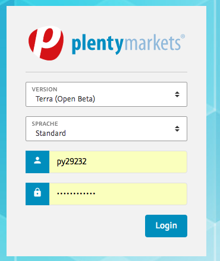
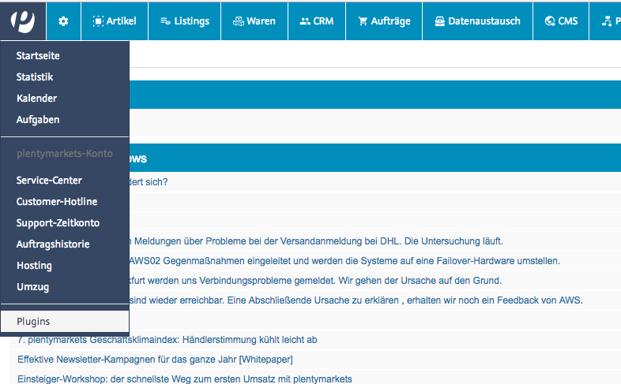

# Payone plugin für plentymarkets 7.x

## Installation

Detaillierte Informationen zur Plugin-Provisionierung finden sich unter [plentymarkets developers](https://developers.plentymarkets.com/dev-doc/basics#plugin-provisioning).

## Konfiguration

Im Folgenden wird beschrieben, wo Sie die Konfiguration der Zahlarten finden und diese anpassen können.

* Um die Plugin-Konfiguration einsehen zu können, muss der Login bereits mit "Terra"-Theme erfolgen: 

* Navigieren Sie zum Plugin Menü:

* Wählen Sie das Payone-Plugin durch Doppelklick:

* Wählen Sie den gewünschten Reiter der Konfiguration:

* Änderungen vornehmen und speichern