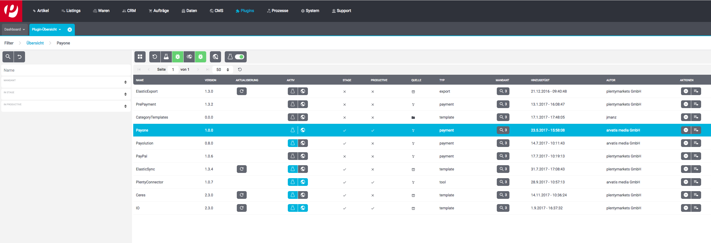
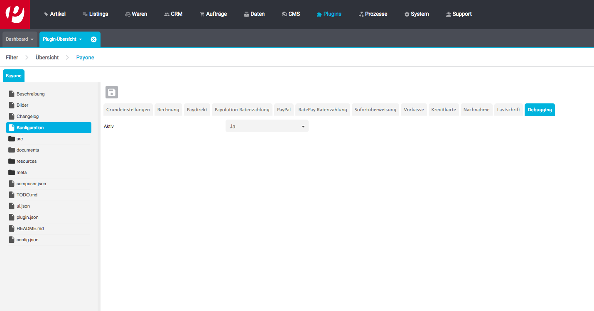

# Payone plugin for plentymarkets 7

   <strong><i>Requirements:</strong></i> The plugin has been developed for the Ceres template. The plugins IO and Ceres 
are required and have to be active.

## Configuration

Set up the payone account and configure the payments method in the plentymarkets backend:

* Navigate to "Plugins"

* Double click on the payone pluging:

* Enter settings in each configuration tab:

* Save changes

## Ereignisaktionen einrichten

To fully integrate the plugin event actions have to be set up for capture, refund and returns. The event actions 
"Payone | Capture order" and "Payone | Refund order" have to be set up according to your workflow.

#Show clearing data on order success page

To add a text to the order success page on how to fullfill the paymen set up the payone payment containers.
The "Payone Order Confirmation Page Payment Data" container needs to be added to the 
 "Order confirmation: Additional payment information" block.
 
 #Zahlarten in Checkout integrieren
 
To fully integrate the plugin the template container "Payone Checkout JS" has to be added to 
"Script loader: After scripts loaded".